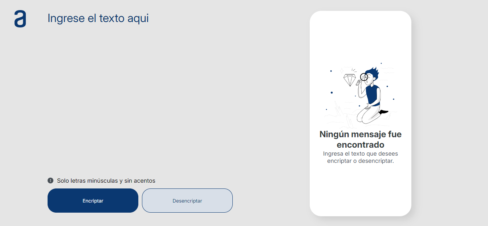

<h1>Challenge: Encriptador<h1/>

<h2>Descripción<h2/>

La página permite ingresar texto que será encriptado o desencriptado, y el usuario puede poder escoger entre as dos opciones, aasi como tambien copiar el resultado que es mostrado en pantalla.

<h2>Características<h2/>

- Encriptación de mensajes.
- Desencriptación de mensajes.
- Interfaz amigable y fácil de usar.
- Validación de entrada para asegurar que solo se usen letras minúsculas y sin acentos.

<h2>Tecnologías Utilizadas<h2/>

- HTML 
- CSS 
- JavaScript
- Figma

